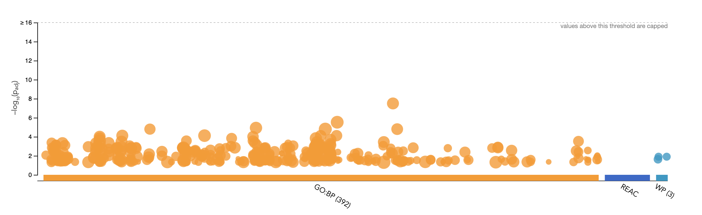
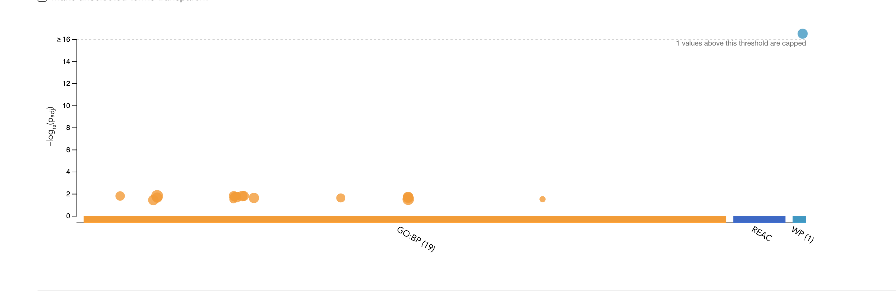

---
title: "BCB420 Assignment 2: Emily So"
output:
  html_document:
    df_print: paged
    toc: true 
  html_notebook: default
  

--- 
# Introduction 

In this assigment, I'm going to be taking the normalized expression data I created in Assignment 1, ranking them by differential expression and performing thesholded over-representation analysis to highlight domain themes in the top set of genes. 

### To recap from Assignment 1:

1. I selected an expression dataset with GEO ID "GSE46562", belonging to the paper "Integrative transcriptome network analysis of iPSC-derived neurons from schizophrenia and schizoaffective disorder patients with 22q11.2 deletion"^1^. This dataset has 9 control samples (no deletion syndrome) and 10 patient samples (deletion syndrome), counting their individual expression across over 15000 genes. The data had already been normalized via FPKM. 

2. I used visualizations such as boxplots and mean-variance plots to present an overview of the dataset.

3. I performed identifier mapping by connecting the Ensembl ID of each gene present in the dataset to its respective HUGO symbol using the package biomaRt. I removed any duplicate UGO symbols or genes that did not map to a HUGO symbol.

4. I filtered and normalized the data. I removed genes that had less than 7 counts per million, and performed TMM normalization on the remaining genes.   

5. Overall, the final dataset generated had the TMM normalized expression of 13918 genes, across 19 samples. 

6. I created a dataset for the samples, which helps easily identify, based on identifier, what test condition a sample belongs to.

Load all the necessary packages:

```{r packages, message=FALSE}
if (!requireNamespace("Biobase", quietly = TRUE))
    install.packages("Biobase")
if (!requireNamespace("BiocManager", quietly = TRUE))
    install.packages("BiocManager")
if (!requireNamespace("DESeq2", quietly = TRUE))
    BiocManager::install("DESeq2")
if (!requireNamespace("limma", quietly = TRUE))
    install.packages("limma")
if (!requireNamespace("ComplexHeatmap", quietly = TRUE))
    install.packages("ComplexHeatmap")
if (!requireNamespace("circlize", quietly = TRUE))
    install.packages("circlize")
if (!requireNamespace("gprofiler2", quietly = TRUE))
    install.packages("gprofiler2")
if (!requireNamespace("dplyr", quietly = TRUE))
    install.packages("dplyr")
if (!requireNamespace("kableExtra", quietly = TRUE))
    install.packages("kableExtra")
if (!requireNamespace("edgeR", quietly = TRUE))
    install.packages("edgeR")
library(Biobase)
library(limma)
library(ComplexHeatmap)
library(circlize)
library(edgeR)
library(gprofiler2)
library(DESeq2)
library(dplyr)
library(kableExtra)
```

# Differential Gene Expression 

## P-values

First I am going to begin by loading the data of the normalized counts and samples dataset from Assignment 1. In the normalized counts dataset, I’m adding prefixes to each sample’s ID to further specify if they are part of the experimental and control group. This will help with visualizations later on. 
```{r}
NormalizedData <- readRDS(file=file.path(getwd(),"data","normalized_counts.rds"))
samples <- readRDS(file=file.path(getwd(),"data","samples.rds"))
columns <- c()
for (name in colnames(NormalizedData[2:20])) {
    type <- samples$group[which(samples$Patient.number == name)]
    if (type == 'patient sample') {
        columns <- append(columns,paste("patient_",name,sep = ""))
    } else {
         columns <- append(columns,paste("control_",name,sep = ""))
    }
}
colnames(NormalizedData) <- c("hgnc_symbol",columns)
NormalizedData$hgnc_symbol = rownames(NormalizedData)
kable(head(NormalizedData),format="html",caption="preview of the normalized_data from Assignment 1") %>% kable_styling()
```


I will now create a design matrix that categorizes samples based off of the test condition they belong to. 

(N.B. I do realize that it was mentioned during lecture that to best limit the false discovery rate, a linear model that takes into account both the test conditions and each sample's individual expression is best. However, when running this time of model on my dataset, the error “No residual degrees of freedom in linear model fits” occurs. Therefore I will use the described design above.)

```{r}
ModelDesign <- model.matrix(~ samples$group)
kable(ModelDesign[7:12,],format = "html", caption = "Model design preview") %>% kable_styling()
```

Originally in this assignment, I had constructed the traditional linear model design fit with empirical Bayes that was shown in lecture. However, for assurance,I decided to consult the paper for insight on differential expression. The paper associated with the dataset ^1^ specified that they "used DESeq2 to determine differential expression from the corrected RNA-seq read count values, analyzing only transcripts with an average FPKM ≥ 1 across all samples". Since I had already filtered out low counts from my data, I decided that it would be best to implement DESeq2 as well. This function performs differential expresssion analysis based on the Negative Binomial distribution. 

```{r,message=FALSE,fig.cap="Mean Variance plot of the normalized dataset",warning=FALSE}
dataMatrix <- as.matrix(NormalizedData[2:20])
d <- DGEList(counts=dataMatrix, group=samples$group)
d <- estimateDisp(d,ModelDesign )
plotMeanVar(d, show.raw.vars = TRUE, show.tagwise.vars=TRUE,
            show.ave.raw.vars = TRUE,
            NBline=TRUE,
            show.binned.common.disp.vars = TRUE)
```


To ensure my dataset follows a negative binomial distribution, I created an MCV plot. I noticed that the red X's in the plot very carefully follow the blue line, which indicates a negative  distribution. Therefore, I knew it was safe to proceed with DESeq2. 


```{r, message=FALSE, warning=FALSE}
counts <- DESeqDataSetFromMatrix(countData = round(NormalizedData[2:20]),colData = samples, design = ~group)
res <- DESeq(counts)
DeSeqOutput <-as.data.frame(results(res))
DeSeqOutput <- cbind(rownames(DeSeqOutput),DeSeqOutput)
colnames(DeSeqOutput) <- c("hgnc_symbol",colnames(DeSeqOutput)[2:7])
```
```{r}
kable(head(DeSeqOutput),format = "html",caption = "preview of differential expression results") %>% kable_styling()
```
## Multiple Hypothesis Testing 

For any scientific expriment, there is a null hypothesis of "there was no change". The p-value is often given a threshold of 0.05 to reject said null hypothesis. For the expression data, in order to reject the null hypothesis for each gene of "there was no differential expression", I will be using a **p-value threshold of 0.05 to determine which genes were significantly differentially expressed**. For multiple hypothesis testing, I will be using the **Benjami-Hochberg method**. I will be using this method because it is able to control the false discovery rate for independent samples, but isn't as stringent as other tests. 

```{r}
length(which(DeSeqOutput$pvalue < 0.05))
length(which(DeSeqOutput$padj < 0.05))
```

The results of the differential expression are very good, with `r length(which(DeSeqOutput$pvalue < 0.05))` **genes being differentially expressed** and `r length(which(DeSeqOutput$padj < 0.05))` **passing the multiple hypothesis correction method.**

## Visualizations

I will use a volcano plot to show the amount of differentially expressed genes, highlighting the downregulated genes in blue and the upregulated genes in red.  

```{r,message=FALSE}
plotVolcano <- cbind(DeSeqOutput$log2FoldChange, -log10(DeSeqOutput$pvalue))
colnames(plotVolcano) <- c("logFC", "P-val")
UpRegulated <- DeSeqOutput$pvalue < 0.05 & DeSeqOutput$log2FoldChange > 0
DownRegulated <- DeSeqOutput$pvalue < 0.05 & DeSeqOutput$log2FoldChange < 0
point.col = case_when(UpRegulated ~ "red",DownRegulated ~ "blue",TRUE ~ "black")
plot(plotVolcano, col = point.col,main="Volcano plot for the differentially expressed genes.")
```


I will now visualize my top hits (those with P-value < 0.01) with a heatmap
```{r,fig.cap="Heatmap of the differentially expressed data"}
# first, create a heatmap matrix of all expression data
HeatmapMatrix <- NormalizedData[,2:20]
rownames(HeatmapMatrix) <- NormalizedData$hgnc_symbol
colnames(HeatmapMatrix) <- colnames(NormalizedData[,2:20])
#now create a heatmap of just the top hits (those that have P-value < 0.01)
tophits <- DeSeqOutput$hgnc_symbol[DeSeqOutput$pvalue < 0.01]
HeatmapTopHits <- t(scale(t(HeatmapMatrix[which(rownames(HeatmapMatrix)
                                                  %in% tophits),])))
if (min(HeatmapTopHits) == 0) {
    HeatmapCol = colorRamp2(c(0,max(HeatmapTopHits)),
                             c("white","red"))
} else {
    HeatmapCol = colorRamp2(c(min(HeatmapTopHits), 0,
                               max(HeatmapTopHits)),
                             c("blue","white","red"))
}
TopHeatmap <- Heatmap(as.matrix(HeatmapTopHits),
                       cluster_rows = TRUE,
                       show_row_dend = TRUE,
                       cluster_columns = FALSE,
                       show_column_dend = FALSE,
                       col=HeatmapCol,
                       show_column_names = TRUE,
                       show_row_names = FALSE,
                       show_heatmap_legend = TRUE)
TopHeatmap
```

Based on the heatmap presented, it appears there is a pretty clear clustering by condition group in the top left and the botttom right of the heatmap with both sections being almost entirely blue, while in the other corners the expression is a little bit ambiguous, but the majority of the section is colored in red so there is clearly a pattern.

I am inferring that the cluster patterns are present baed on the condition of the sample (i.e. all controls have the same expression levels for certain genes, all tests have the same expression level for others). This is due to the fact that the two test conditions are grouped together in the heatmap, allowing for the clustering to occur. In the ORA, hopefully I will be able to understand the reasoning for the clustering more. 

# Thresholded analysis 

I will be performing a gene enrichment analysis on a thresholded ranked list of upregulated and downregulated genes, as well as the entire differential gene dataset. 
```{r}
# calculate how many genes are upregulated and down regulated
UpregulatedGenes <- DeSeqOutput$hgnc_symbol[which(DeSeqOutput$pvalue < 0.05 & DeSeqOutput$log2FoldChange > 0)]
DownregulatedGenes <- DeSeqOutput$hgnc_symbol[which(DeSeqOutput$pvalue < 0.05 & DeSeqOutput$log2FoldChange < 0)]
#Save results to file
write.table(x=UpregulatedGenes,
            file="data/UpregulatedGenes.txt", sep = "\t",
            row.names = FALSE,col.names = FALSE,quote = FALSE)
write.table(x=DownregulatedGenes,
            file="data/downregulatedgenes.txt", sep = "\t",
            row.names = FALSE,col.names = FALSE,quote = FALSE)
```

I used the tool G-profiler to run a functional profiling analysis on these genesets to further investigate what biological pathways they might be involved in. I used the **annotation sources** GO Biological Processes (release 2020-12-08), Reactome (release 2020-12-15) and WikiPathways (release 20201210) as I am comfortable interpreting those results. I used the Benjami-Hochberg (FDR) **correction method** for similar advantages that I stated before. I used a **threshold** of 0.05 again. 

```{r}
UpRegQuery <- gost(query = UpregulatedGenes,organism = "hsapiens",sources = c("REAC","GO:BP","WP"),correction_method = "fdr")
DownRegQuery <- gost(query = DownregulatedGenes,organism = "hsapiens",sources = c("REAC","GO:BP","WP"),correction_method = "fdr")
AllQuery <- gost(query = DeSeqOutput$hgnc_symbol,organism = "hsapiens",sources = c("REAC","GO:BP","WP"),correction_method = "fdr")
```

## Results of analysis 

Below are previews of tables from the upregulated, downregulated and total gene queries. I have also attached the visual results from the up and down regulated gene sets, I was unable to run the total gene dataset on the g::profiler website as the file was too large. 

### Total dataset
I do not have a graphical overview of the results, as G-profiler informed me the dataset was to large to run on the web tool. 
```{r}
#GO results 
kable(head((subset(AllQuery$result,grepl("GO",AllQuery$result$term_id, fixed = TRUE))) %>% select(9,11,4,5,6)),format = "html",caption = "Gene Ontology results of total dataset",row.names = FALSE) %>% kable_styling()
#WP results
kable(head((subset(AllQuery$result,grepl("WP",AllQuery$result$term_id, fixed = TRUE))) %>% select(9,11,4,5,6)),format = "html",caption = "WikiPathway term results of total dataset",row.names = FALSE) %>% kable_styling()
#Reactome results
kable(head((subset(AllQuery$result,grepl("REAC",AllQuery$result$term_id, fixed = TRUE))) %>% select(9,11,4,5,6)),format = "html",caption = "Reactome term results of total dataset",row.names = FALSE) %>% kable_styling()
```


### Upregulated Genes 



```{r}
#GO Results
kable(head((subset(UpRegQuery$result,grepl("GO",UpRegQuery$result$term_id, fixed = TRUE))) %>% select(9,11,4,5,6)),format = "html",caption = "Gene Ontology results of upregulated genes",row.names = FALSE) %>% kable_styling()
#WP Results
kable(head((subset(UpRegQuery$result,grepl("WP",UpRegQuery$result$term_id, fixed = TRUE))) %>% select(9,11,4,5,6)),format = "html",caption = "WikiPathway term results of upregulated genes",row.names = FALSE) %>% kable_styling()
```

### Downregulated genes



There were no Reactome terms for the dataset of downregulated genes. 

```{r}
#GO results 
kable(head((subset(DownRegQuery$result,grepl("GO",DownRegQuery$result$term_id, fixed = TRUE))) %>% select(9,11,4,5,6)),format = "html",caption = "Gene Ontology results of downregulated genes",row.names = FALSE) %>% kable_styling()
#WP Results
kable(head((subset(DownRegQuery$result,grepl("WP",DownRegQuery$result$term_id, fixed = TRUE))) %>% select(9,11,4,5,6)),format = "html",caption = "WikiPathway term results of downregulated genes",row.names = FALSE) %>% kable_styling()
```

## Top Terms / Interpretation

### Upregulated Dataset

***Go Biological Pathways***

```{r,echo = FALSE}
GOUpreg <- (subset(UpRegQuery$result,grepl("GO",UpRegQuery$result$term_id, fixed = TRUE)))
WPUpreg <- (subset(UpRegQuery$result,grepl("WP",UpRegQuery$result$term_id, fixed = TRUE)))
```

Top Term: `r GOUpreg$term_id[1]`:`r UpRegQuery$result$term_name[1]`

Term size: `r GOUpreg$term_size[1]`

Query size `r GOUpreg$query_size[1]`

Intersection size: `r GOUpreg$intersection_size[1]`


***Wiki Pathways***

Top Term: `r WPUpreg$term_id[1]`:`r WPUpreg$term_name[1]`

Term size: `r WPUpreg$term_size[1]`

Query size `r WPUpreg$query_size[1]`

Intersection size: `r WPUpreg$intersection_size[1]`

From the query of the upregulated genes, the top terms returned are related to response to Focal Segmental Glomerulosclerosis, a disease in which scar tissue develops in parts of the kidney. It has been stated that Adaptive response to several stimuli resulting in glomerular hypertension, hyperfiltration and eventual hypertrophy can result in FSGS^2^. Therefore, the upregulated genes are greatly related to **cellular reponse to external physical and chemical stimuli**. 

### Downregulated Pathways 
```{r,echo = FALSE}
GODownreg <- (subset(DownRegQuery$result,grepl("GO",DownRegQuery$result$term_id, fixed = TRUE)))
WPDownreg <- (subset(DownRegQuery$result,grepl("WP",DownRegQuery$result$term_id, fixed = TRUE)))
```

***Go Biological Pathways***

Top Term: `r GODownreg$term_id[1]`:`r GODownreg$result$term_name[1]`
Term size: `r GODownreg$term_size[1]`
Query size `r GODownreg$query_size[1]`
Intersection size: `r GODownreg$intersection_size[1]`

***Wiki Pathways***

Top Term: `r WPDownreg$term_id[1]`:`r WPDownreg$term_name[1]`
Term size: `r WPDownreg$term_size[1]`
Query size `r WPDownreg$query_size[1]`
Intersection size: `r WPDownreg$intersection_size[1]`

Shown through the results of the WikiPathways and the GO Biological Processes, it is quite evident that the downregulated genes are most related to the development of disorders associated with 22q11.2 deletion syndrome. The terms present are largely related to the development of the deletion syndrome itself, or **development of different regions of the brain**.

### Total gene dataset

```{r,echo=FALSE}
#Total dataset results 
GOAll <- ((subset(AllQuery$result,grepl("GO",AllQuery$result$term_id, fixed = TRUE))) %>% select(9,11,4,5,6))
WPAll <- ((subset(AllQuery$result,grepl("WP",AllQuery$result$term_id, fixed = TRUE))) %>% select(9,11,4,5,6))
ReacAll <- ((subset(AllQuery$result,grepl("REAC",AllQuery$result$term_id, fixed = TRUE))) %>% select(9,11,4,5,6))
```

***Go Biological Pathways***

 Top Term: `r GOAll$term_id[1]`:`r GOAll$result$term_name[1]`
Term size: `r GOAll$term_size[1]`
Query size `r GOAll$query_size[1]`
Intersection size: `r GOAll$intersection_size[1]`

***Wiki Pathways***

Top Term: `r WPAll$term_id[1]`:`r WPAll$term_name[1]`
Term size: `r WPAll$term_size[1]`
Query size `r WPAll$query_size[1]`
Intersection size: `r WPAll$intersection_size[1]`

***Reactome Pathways***

Top Term: `r ReacAll$term_id[1]`:`r ReacAll$term_name[1]`
Term size: `r ReacAll$term_size[1]`
Query size `r ReacAll$query_size[1]`
Intersection size: `r ReacAll$intersection_size[1]`

The results from the total gene query are much more generic, where top terms are most related to **metabolic processes or RNA metabolism**. 

# Interpretation 

1. Do the over-representation results support conclusions or mechanism discussed in the original paper?

The evidence from the enrichment analysis of the downregulated genes directly supported the conclusions of the paper^1^. The main conclusion of the paper were that the phenotypes of 22q11.2 deletion syndrome were primarily caused by disruptions in brain development. The paper also performed differential expression, in which pathways associated with embryonic brain development and disruption of brain function during adolescence were identified to be the most affected. The entire dataset of downregulated genes was related to brain development and function and was most clearly related to the conclusions brought about in this paper. 

2. Can you find evidence to support some of the results that you see? 

A publication that I found, "Immunodeficiency and autoimmunity in 22q11.2 deletion syndrome"^3^, provided evidence for the results found in the upregulated genes. Like mentioned before, upregulated genes were found to be largely connected to ***cellular response to stimuli***. It was determined in this paper that patients with 22q11.2 deletion syndrome have impaired immune function/increased risk of infection. Molecuarly, this was determined to be most likely due to T-cell deficiency, abnormalities of T-cell clonality or impairment of proliferative responses in the patients. Given my results of the over-enrichment analysis of the upregulated genes, there is a possibility that the upregulated genes correlation to cellular reponse results in affected patients' weakened immune system. 


# Citations 

1. Lin, M., Pedrosa, E., Hrabovsky, A. et al. Integrative transcriptome network analysis of iPSC-derived neurons from schizophrenia and schizoaffective disorder patients with 22q11.2 deletion. BMC Syst Biol 10, 105 (2016). https://doi.org/10.1186/s12918-016-0366-0

2. Guruswamy Sangameswaran KD, Baradhi KM. Focal Segmental Glomerulosclerosis. [Updated 2020 Aug 24]. In: StatPearls [Internet]. Treasure Island (FL): StatPearls Publishing; 2021 Jan-. Available from: https://www.ncbi.nlm.nih.gov/books/NBK532272/

3. McLean-Tooke A, Spickett GP, Gennery AR. Immunodeficiency and autoimmunity in 22q11.2 deletion syndrome. Scand J Immunol. 2007 Jul;66(1):1-7. doi: 10.1111/j.1365-3083.2007.01949.x. PMID: 17587340.

