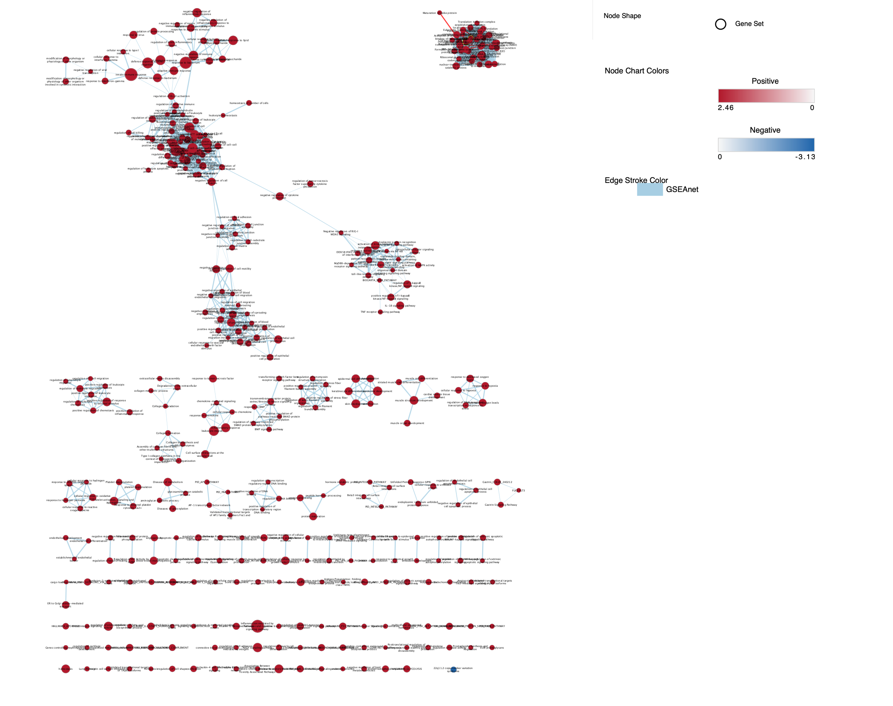
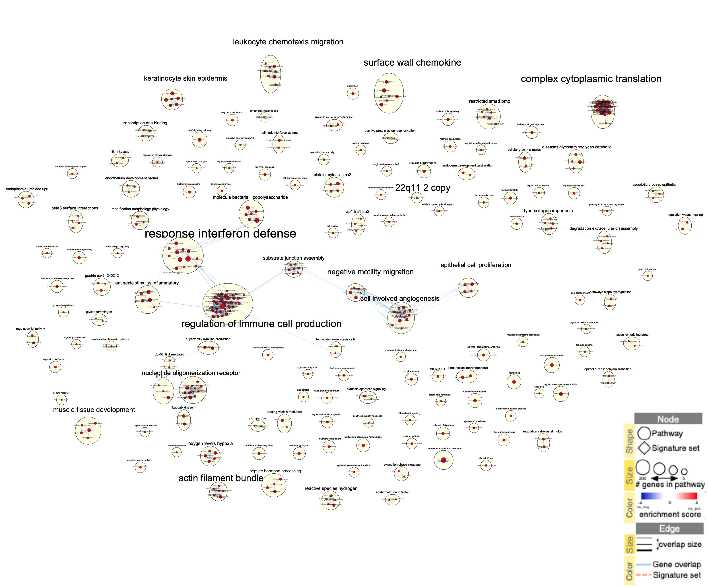
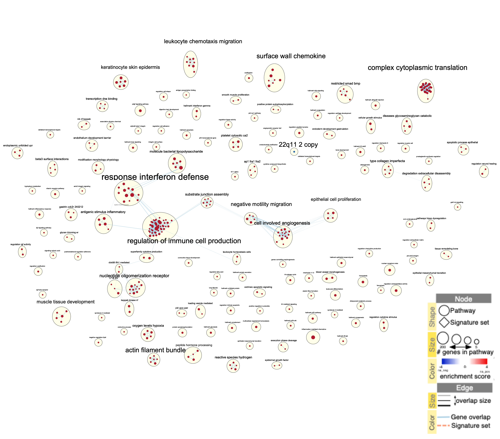
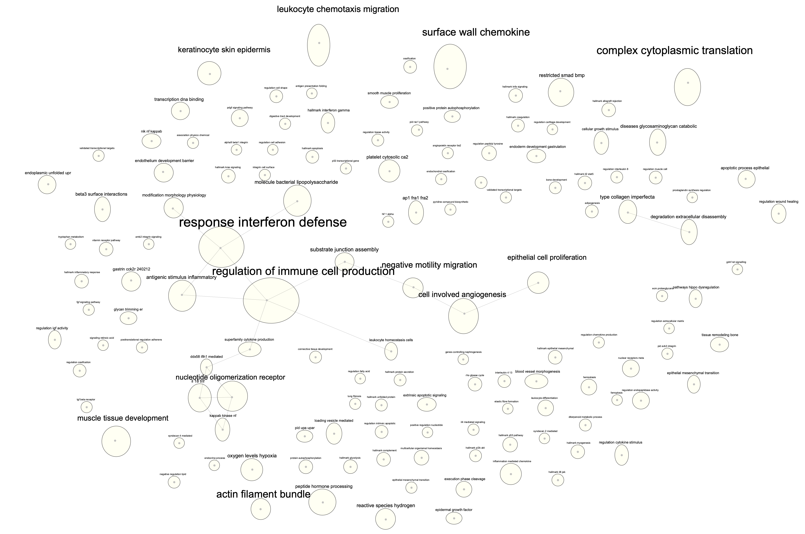
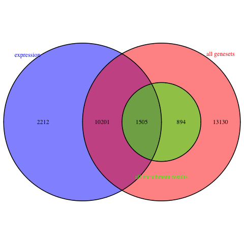
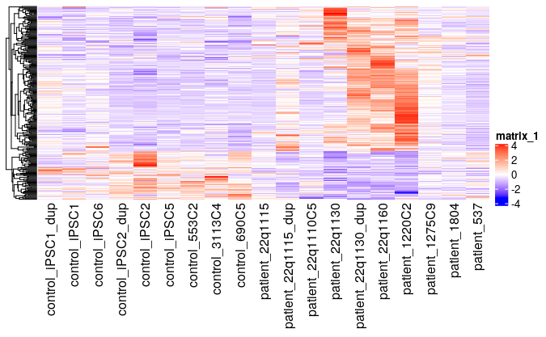
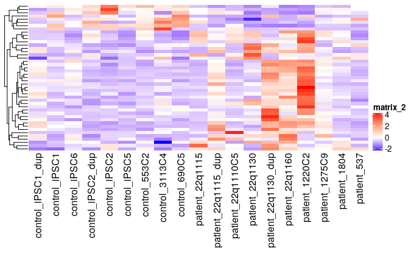

# Introduction 

In this assigment, I'm going to be taking the ranked data that was created in Assignment #2 and perform non-thresholded pathway analysis. Once that is performed, I will summarize/visualize my results using the Enrichment Map Pipeline. I will interpret the results and analyze "dark matter" present within the data. 

# To recap from Assignment 1 and 2:
 
### Assignment 1
1. I selected an expression dataset with GEO ID "GSE46562", belonging to the paper "Integrative transcriptome network analysis of iPSC-derived neurons from schizophrenia and schizoaffective disorder patients with 22q11.2 deletion"^1^. This dataset has 9 control samples (no deletion syndrome) and 10 patient samples (deletion syndrome), counting their individual expression across over 15000 genes. The data had already been normalized via FPKM. 

2. I used visualizations such as boxplots and mean-variance plots to present an overview of the dataset.

3. I performed identifier mapping by connecting the Ensembl ID of each gene present in the dataset to its respective HUGO symbol using the package biomaRt. I removed any duplicate UGO symbols or genes that did not map to a HUGO symbol.

4. I filtered and normalized the data. I removed genes that had less than 7 counts per million, and performed TMM normalization on the remaining genes.   

5. Overall, the final dataset generated had the TMM normalized expression of 13918 genes, across 19 samples. 

6. I created a dataset for the samples, which helps easily identify, based on identifier, what test condition a sample belongs to.

### Assignment 2

1. A design matrix was created, categorizing samples based on the experimental condition they belonged to. 

2. For each gene present in the final dataset from Assingment 1, differential expression was calculated using DeSeq^2^, fitting with the created design matrix. 

3. The Benjami-Hochberg method was used for multiple hypothesis testing and the number of genes significanty expressed and who passed correction was calculated.  362 genes were signigificantly differentially expressed (with a p-value threshold of 0.05) and 30 genes passed the multiple hypothesis correction method.

4. Volcano plots and Heatmaps were used to visualize the differential expression

5. Using the genes whose differential expression was calculated, upregulated (those with logFC > 0) and downregulated genes (those with logFC < 0) were separated into separate gene lists. 

6. Each of the lists were subject to thresholded analysis by g::Profiler. This is used to identify biological themes for each list. The databases searched were Reactome, WikiPathways and GO::BP. Thresholded analysis was also performed on the total analysis dataset 

7. From the thresholded analysis, the themes returned were the following:
  i) Upregulated genes were most associated with pathways related to **cellular response to stimuli**
  ii) Downregulated genes were most associated with pathways related to **brain development**
  iii) The total dataset was most associated with pathways related to **metabolic process or RNA metabolism**
  

# Packages 

Install all necessary packages
```{r message=FALSE}
if(!requireNamespace("RCy3", quietly = TRUE)){
  if (!requireNamespace("BiocManager", quietly = TRUE)){
      install.packages("BiocManager")
    }
  BiocManager::install("RCy3")
}
if(!requireNamespace("RCurl", quietly = TRUE)){
  install.packages("RCurl")
}
if(!requireNamespace("kableExtra", quietly = TRUE)){
  install.packages("kableExtra")
}
if(!requireNamespace("dplyr", quietly = TRUE)){
  install.packages("dplyr")
}
if (!requireNamespace("BiocManager", quietly = TRUE))
    install.packages("BiocManager")

BiocManager::install("DESeq2")

if(!requireNamespace("GSA", quietly = TRUE)){
  install.packages("GSA")
}
if(!requireNamespace("VennDiagram", quietly = TRUE)){
  install.packages("VennDiagram")
}
if(!requireNamespace("ComplexHeatmap", quietly = TRUE)){
  install.packages("ComplexHeatmap")
}
if(!requireNamespace("circlize", quietly = TRUE)){
  install.packages("circlize")
}
library(RCy3)
library(RCurl)
library(kableExtra)
library(dplyr)
library(DESeq2)
library(GSA)
library(VennDiagram)
library(ComplexHeatmap)
library(circlize)
```
# Non-Thresholded Gene Enrichment Analysis

## GSEA 

I will specifically be **using the method of GSEA preranked analysis**^3^^4^.For this process, two types of files are required: a rnak file (rnk) and a geneset file (gmt)

The **geneset files that I will be using** is the most recent Human Geneset from the baderlab collection (version created on March 2021, containing GO biological process, no IEA and pathways). The format is a .gmt file. 
```{r message = FALSE}
gmtUrl = "http://download.baderlab.org/EM_Genesets/March_01_2021/Human/symbol/" 
filenames = getURL(gmtUrl)
tc = textConnection(filenames)
contents = readLines(tc)
close(tc)
# get the gmt that has all the pathways and does not include terms inferred from
# electronic annotations(IEA) start with gmt file that has pathways only
rx = gregexpr("(?<=<a href=\")(.*.GOBP_AllPathways_no_GO_iea.*.)(.gmt)(?=\">)", contents, 
              perl = TRUE)
gmtFile = unlist(regmatches(contents, rx))
download.file(paste(gmtUrl, gmtFile, sep = ""), destfile = "geneset.gmt") # save the file
```

## Import Gene Sets 
  First, it is required that I import the full list of genes that were analyzed in the differential expression from Assignment 2. The full analysis dataset is required as GSEA requires both strong and weak signals to perform a correct analysis. 
  
  Since DeSeq2 does not automatically calculate ranks of genes given their statistics (like packages such as edgeR). A documented way to range genes is to use the **signed fold change** metric (-log10(Pvalue) * sign(log fold change) and has been done in many RNA-seq analyses^5^. This method is used to ensure that all upregulated genes are given a positive rank, and all downregulated genes are given a negative rank.I will be saving the HGNC symbols along with their corresponding metric to the file ranked.rnk.

```{r}
DeSeqOutput <- readRDS(file=file.path(getwd(),"data","DeSeqOutput.rds"))
DeSeqOutput$metric = -log10(DeSeqOutput$pvalue) * sign(DeSeqOutput$log2FoldChange)
NewDeSeq <- arrange(DeSeqOutput,desc(metric)) %>% select(1,8)
write.table(x=NewDeSeq,
            file="data/ranked.rnk", sep = "\t",
            row.names = FALSE,col.names = FALSE,quote = FALSE)
```

GSEAPreranked was performed on the web server GenePattern, with a **minimum geneset size** of 15 and a **maximum geneset size** of 200. All other parameters were left to the default. 

```{r, echo=FALSE}
UpRegData <- read.table(file = './data/new_upreg.tsv', sep = '\t', header = TRUE, fill = TRUE)
UpRegData$X = NULL
UpRegData$NAME = NULL
kable(head(UpRegData,10),format = "html",caption = "Table 1: Preview of report of upregulated genes",row.names = FALSE) %>% kable_styling()

```
### TOP GENESET 

Name: `r UpRegData$GS.br..follow.link.to.MSigDB[1]`

P-value: `r UpRegData$NOM.p.val[1]` 

ES: `r UpRegData$ES[1]`

NES: `r UpRegData$NES[1]`

FDR: `r UpRegData$FDR.q.val[1]`

number of genes in leading edge: `r UpRegData$SIZE[1]`

```{r}
DownRegData <- read.table(file = './data/new_downreg.tsv', sep = '\t', header = TRUE, fill = TRUE)
DownRegData$X = NULL

kable(head(DownRegData,10),format = "html",caption = "Table 2: Preview of report of downregulated genes",row.names = FALSE) %>% kable_styling()
```
### TOP GENESET 

Name: `r DownRegData$GS.br..follow.link.to.MSigDB[1]`

P-value: `r as.numeric(DownRegData$NOM.p.val[1])` 

ES: `r DownRegData$ES[1]`

NES: `r DownRegData$NES[1]`

FDR: `r DownRegData$FDR.q.val[1]`

number of genes in leading edge: `r DownRegData$SIZE[1]`

When **comparing to the thresholded analysis from Assignment 2**, the results from the GSEAPreranked wasn't exactly a straightforward comparsion and at points required inferences to make a correlation.

The top themes returned by the positive enrichment report (upregulated genes) in the threshholded analysis in Assignment 2 were cell migration and response to stimulus, which upon further research seemed to point towards immune response or response to various stresses. The non-threshholded analysis returned genesets pointing to regulation on endothethial cell migration which has an obvious correlation to the "cell migration" theme . The other genesets returned had names corresponding to leukocyte and lymphocyte proliferation and activation. Leukocyte and lymphocytes are types of white blood cells and therefore the regulation on their production could be in correlation to an pathogenic infection or type of immune response. Therefore, the correlation between these genesets and the terms of "response to stimulus" from the past analysis was prevalent. 


The top themes returned by the  negative enrichment report (downregulated genes) in the threshholded analysis were metacephalon development, cerbellar cortex formation and outflow tract morphogenesis, which are involved in brain development differentiation/function The non-threshholded analysis returned genesets on synaptic pathways, signal transfers and release and neurotransmitter secretion which are practically exclusive to brain function and development. Furthermore, both the non-thresholded and the thresholded analyses returned information on a WikiPathways term named "22Q11.2 COPY NUMBER VARIATION SYNDROME", the syndrome of the test conditions samples in this dataset. Therefore, there was a strong correlation between the two analyses for the downregulated genes. However, there were some genesets (such as FATTY ACYL-COA BIOSYNTHESIS) that I had trouble finding a correlation between and will require further investigation.

# Visualization with Cytoscape 

The next step in this assignment was to take the reports of the positive and negative enrichment reports (the two tables shown above) and create an EnrichmentMap Network in Cytoscape. My dataset contained a myriad of genesets with nominal p-value 0.0 and the default parameters (p value threshold of 1.0 and FDR threshold of 0.1) returned an interaction network of almost 1500 nodes. Therefore, I decided to consult the EnrichmentMap documentation^6^. The documentation provided a list of possible thresholds and I decided to try the permutation for " conservative" of **p < 0.005 and FDR < 0.05**. I also did 50% overlap, which was recommended for most analyses. The resulting network was slightly cleaner, with **379 nodes and 1644 edges**. 


Next, I **annotated** the network using the app AutoAnnotate. I **used the default parameters**, selecting to **create singleton clusters** and spread out the annotation to **avoid cluster overlap**.


To make a **publication ready figure**, individual node labels were removed for clarity using the Enrichment Map app. I didn't need to make any other changes, as the node clusters were already spread out for clarity. 


The network was then **collapsed to a theme network** using AutoAnnotate. The resulting network had **134 nodes and 18 edges**. 

In a bizarre fashion, only one downregulated geneset (the WikiPathways geneset 22Q11.2 COPY NUMBER VARIATION SYNDROME) was present in the EnrichmentMap Network. I played around with the thresholds again and found that even at the default parameters, only one gene still showed. Therefore, it was almost impossible to infer the major themes of the downregulated genes. 

Some of the most apparent themes in the upregulated genes are response interferon defense and regulation of immune cell production. Upon research on WikiPathways, I discovered this was directly related to the top geneset in the upregulated gene set: HALLMARK TNFA SIGNALING VIA NFKB. IN 2011^7^, it was documented that NFKB (otherwise known as the nuclear factor kB), is a transcription factor that directly regulates the expression of genes involved in cell survival and immune responses. Interferons such as TNF-alpha (TNFA), the key players in activating a response to pathogenic infection, participate in a signaling pathway preceded by NFKB activation and ultimately leads to antiviral actvity and apoptosis. Not only are these two themes strongly relevant to immune response, I found that several other fo the major themes (surface wall chemokine, leukocyte chemotaxis migration, complex cyotoplasmic translation) were either pathways involved in the activation/signalling of immune cells or were pathways that took place during an immune response. Therefore, these two themes in the upregulated genesets strongly adhere to the theme of **upregulated genes being involved in immune responses/cellular repsonse to stimuli** and **fit well with past analyses of the model**.  

A **novel pathway** present in the theme map were muscle tissue development and actin filament bundle, which I will have to do further research on. Other than that, there were no pathways inconsistent with previous analysis. 


# Interpretation

1. Do the enrichment results support conclusions or mechanism discussed in the original paper?

The enrichment results continue to support conclusions/mechanisms discussed in the original paper. As shown through our GSEApreranked, the top genesets returned for upregulated genes were related to immune reponse and top genesets returned for downregulated genes were related to synaptic vesicle pathways. It was mentioned in the paper that one of the top GO terms returned in their differential analysis was immune reponse (followed by programmed cell death), suggesting a molecular link between immune deficiency and additional disruption of synaptogenesis (formation of synapses between neurons) in 22q11.2 DS. It was also dicussed that the diminished dosage of the 22q11.2 genes in affected individuals may affect SZ brain development and act by disrupting mitochondrial function, particularly during activity-dependent synaptogenesis.^1^ These were very important findings present in the paper that was clearly reflected through the GSEA.

2. How do these results differ from the results you got from Assignment #2 thresholded methods?

As shown in the header of "GSEA results" the results were pretty consistent among both the thresholded and the non-thresholded analyses. The one thing that differed was there was no mention of Primary Focal Segmental Glomerulosclerosis (FSGS), one of the top WikiPathways terms returned for Assignment 2.There was also no genesets returned referring to actual development of regions of the brain, such as cerebellar cortex development. There were only genesets that correlated to brain cell function.  

3. Can you find evidence, i.e. publications, to support some of the results that you see. How does this evidence support your result?

One of the papers that I was able to find was by Morsheimer et. al^8^, outlining the fact that immunodeficiency is a central component of 22q11.2 deletion syndrome. The researchers concluded that the immunodeficiency is caused by a small thymus present in affected individuals. This affliction results in dysfunctional B cells, T cell exhaustion and high rates of atopy and autoimmunity. This results in the clear phenotype of a weakened immune system, which might support the evidence in the GSEA analysis that immune response is a major theme in differential expression. 

## Dark Matter

I have chosen to highlight the genes that are significantly differentially expressed in the model but aren't annotated to any pathways, otherwise known as Dark Matter. 

The first files that I am going to retrieve are:

1. Defintion of genesets that are used in the analysis (the gmt file)

```{r}
gmtFile <- file.path(getwd(), "geneset.gmt")
capture.output(genesets<- GSA.read.gmt(gmtFile),file="gsa_load.out")
names(genesets$genesets) <- genesets$geneset.names
NormalizedData <- readRDS(file=file.path(getwd(),"data","normalized_counts.rds"))

```
2. Expression file (Normalized counts from Assignment 1) and rank file. 
```{r}
expression <- NormalizedData
ranks <- NewDeSeq
```
3. The GSEA results file (both the na_neg and na_pos). Instead of making a GSEA file, I just took the tsv's associated with negative and positive enrichment scores and placed them in my data folder. 
```{r}
  enrFile1 <- read.table(file.path(getwd(),"data","new_upreg.tsv"), 
                        header = TRUE, sep = "\t", quote="\"",  
                        stringsAsFactors = FALSE,row.names=1)
  enrFile2 <- read.table(file.path(getwd(),"data","new_downreg.tsv"), 
                        header = TRUE, sep = "\t", quote="\"",  
                        stringsAsFactors = FALSE,row.names=1)
  
```
4. All genes in the **significant enrichment results**- FDR threshold of 0.001
```{r}
FDRThreshold <- 0.001
#get the genes from the set of enriched pathways (no matter what threshold)
allSigEnrGenesets<- c(rownames(enrFile1)[which(enrFile1[,"FDR.q.val"]<=FDRThreshold)], rownames(enrFile2)[which(enrFile2[,"FDR.q.val"]<=FDRThreshold)])
genesSigEnrGs <- c()
for(i in 1:length(allSigEnrGenesets)){
  current_geneset <- unlist(genesets$genesets[which(genesets$geneset.names %in% allSigEnrGenesets[i])]) 
  genesSigEnrGs <- union(genesSigEnrGs, current_geneset)
}
```
5. All unique gene names in the geneset file
```{r}
genesAllGs <- unique(unlist(genesets$genesets))
```
There are `r length(genesAllGs)` unique genes in the geneset file. 

I will now create a venn diagram of Dark Matter Overlaps 
```{r message=FALSE}
A <- genesAllGs
B <- genesSigEnrGs
C <- expression[,1]
png(file.path(getwd(),"figures","darkMatterOverlaps.png"))
draw.triple.venn(
    area1=length(A), 
    area2=length(B), 
    area3 = length(C),
    n12 = length(intersect(A,B)),
    n13=length(intersect(A, C)), 
    n23 = length(intersect(B,C)),
    n123 = length(intersect(A,intersect(B,C))), 
    category = c("all genesets", "all enrichment results", "expression"),
    fill = c("red","green","blue"),
    cat.col = c("red","green","blue")
  )
```



Now, I must retrieve the sets of genes that have no annotation 
```{r}
genesNoAnnotation <- setdiff(expression[,1], genesAllGs)
```
Now, get the top ranked genes that have no annotation
```{r}
rankedGeneNoAnnotation <- ranks[which(ranks[,1] %in% genesNoAnnotation),]
rownames(rankedGeneNoAnnotation) = NULL
rankedGeneNoAnnotation[1:10,]
names(rankedGeneNoAnnotation) = c("hgnc_symbol","rank")
kable(rankedGeneNoAnnotation[1:10,],format = "html",caption = "Table 1:Top ranked genes with no annotation",row.names = FALSE) %>% kable_styling()
```
Some of the top ranked genes shown in the "no annotation" table above are as follows. All information was found in GeneCards^9^:
1. TSPEAR-AS1/AS2 - genes associated with antisense RNA and diseases such as Deafness. I was able to find a slight correlation between the two diseases with 38% individuals with 22q11.2 DS (in a sample) were found to be afflicted with some sort of hearing loss ^10^.

2. BZW1 - protein coding gene associated with the bacterial disesase Ulceroglandular Tularemia.I wasn't able to find any common symptoms between this disease and 22q11.2 DS.

3. PODNL1 - protein-coding gene that is thought to function to inhibit smooth muscle cell proliferation and migration following arterial injury. This could be related to 22q11.2 deletion syndrome, as a major theme in the analyses is cell migration, epithelial cell proliferation and mesenchymal transition

4. SSC4D - protein-coding gene whose antibodes are directly related to the development of the immune system and the regulation of both innate and adaptive immune responses. This has a clear correlation to the results of the enrichment analyses, which had major themes of immune response and regulation of immune cell proliferation. 

5. MAGED4B	- gene whose expression is specific to the brain. This is most likely related to the pathways found in the downregulated gene set, which had a major theme of brain development and function. 


Now, two visualizations will follow of the genes that are not annotated:

1. Include a heatmap of any significant genes that are not annotated to any of the pathways returned in the enrichment analysis. This involves making a heatmap of the set difference between the expression genes and the genes present in the enrichment files. This can be shown in the venn diagram as the part of the blue circle that does not overlap the green circle.

```{r}
genesNoAnnotation <- setdiff(rownames(expression), genesSigEnrGs)
rankedGeneNoAnnotation <- ranks[which(ranks[,1] %in% genesNoAnnotation),]
```
There will be `r nrow(rankedGeneNoAnnotation)` in this set. I filtered using a significance threshold of p < 0.05
```{r message = FALSE}
genesTable <- DeSeqOutput %>% filter(pvalue < 0.05)

topHits <- genesTable[which(rownames(genesTable) %in%rankedGeneNoAnnotation$hgnc_symbol),]
topHits <- rownames(topHits)
heatmapMatrix <- expression[,2:20]
heatmapMatrixTophits <- t(
  scale(t(heatmapMatrix[which(rownames(heatmapMatrix) %in% topHits),]))) 
metainfo <- readRDS(file=file.path(getwd(),"data","samples.rds"))
orderedMeta <- metainfo %>% arrange(group)
orderedHeatmapMatrixTophits <- heatmapMatrixTophits[, orderedMeta$Patient.number]

if (min(orderedHeatmapMatrixTophits) == 0) {
    HeatmapCol = colorRamp2(c(0,max(orderedHeatmapMatrixTophits)),
                             c("white","red"))
} else {
    HeatmapCol = colorRamp2(c(min(orderedHeatmapMatrixTophits), 0,
                               max(orderedHeatmapMatrixTophits)),
                             c("blue","white","red"))
}
AllHeatmap <- Heatmap(as.matrix(orderedHeatmapMatrixTophits),
                       cluster_rows = TRUE,
                       show_row_dend = TRUE,
                       cluster_columns = FALSE,
                       show_column_dend = FALSE,
                       col=HeatmapCol,
                       show_column_names = TRUE,
                       show_row_names = FALSE,
                       show_heatmap_legend = TRUE)
AllHeatmap
```


2. Include a heatmap of any significant genes that are not annotated to any pathways in the entire set of pathways used in the analysis. This can be explained through the venn diagram as making a heatmap of the genes present in the blue circle that do not overlap the pink or green circles. 
```{r,fig.cap="Heatmap of the differentially expressed data"}
# first, create a heatmap matrix of all expression data
genesNoAnnotation <- setdiff(rownames(expression), genesAllGs)
rankedGeneNoAnnotation <- ranks[which(ranks[,1] %in% genesNoAnnotation),]
```
There will be `r nrow(rankedGeneNoAnnotation)` in this set I then further filtered using a significance threshold of p < 0.05. 
```{r message = FALSE}
genesTable <- DeSeqOutput %>% filter(pvalue < 0.05)

topHits <- genesTable[which(rownames(genesTable) %in%rankedGeneNoAnnotation$hgnc_symbol),]
topHits <- rownames(topHits)

heatmapMatrixTophits <- t(
  scale(t(heatmapMatrix[which(rownames(heatmapMatrix) %in% topHits),]))) 
metainfo <- readRDS(file=file.path(getwd(),"data","samples.rds"))
orderedMeta <- metainfo %>% arrange(group)
orderedHeatmapMatrixTophits <- heatmapMatrixTophits[, orderedMeta$Patient.number]

if (min(orderedHeatmapMatrixTophits) == 0) {
    HeatmapCol = colorRamp2(c(0,max(orderedHeatmapMatrixTophits)),
                             c("white","red"))
} else {
    HeatmapCol = colorRamp2(c(min(orderedHeatmapMatrixTophits), 0,
                               max(orderedHeatmapMatrixTophits)),
                             c("blue","white","red"))
}
TopHeatmap <- Heatmap(as.matrix(orderedHeatmapMatrixTophits),
                       cluster_rows = TRUE,
                       show_row_dend = TRUE,
                       cluster_columns = FALSE,
                       show_column_dend = FALSE,
                       col=HeatmapCol,
                       show_column_names = TRUE,
                       show_row_names = FALSE,
                       show_heatmap_legend = TRUE)
TopHeatmap
```



There doesn't appear that there was any clear clustering present in both heatmaps, in either groups of patient and control samples. There was a significant decrease in number of genes after the significance threshold of p < 0.05 (going from 2212 to 45 genes in the last heatmap). Therefore, the majority of genes not annotated in any of the pathways are weak signals/not significantly expressed.

# Citations 
1. Lin, M., Pedrosa, E., Hrabovsky, A. et al. Integrative transcriptome network analysis of iPSC-derived neurons from schizophrenia and schizoaffective disorder patients with 22q11.2 deletion. BMC Syst Biol 10, 105 (2016). https://doi.org/10.1186/s12918-016-0366-0

2. Love, M.I., Huber, W., Anders, S. Moderated estimation of fold change and dispersion for RNA-seq data with DESeq2 Genome Biology 15(12):550 (2014)

3. Subramanian, Tamayo, et al. (2005, PNAS 102, 15545-15550) 

4. Mootha, Lindgren, et al. (2003, Nat Genet 34, 267-273).

5. Sim CB, Ziemann M, Kaspi A, Harikrishnan KN, Ooi J, Khurana I, Chang L, Hudson JE, El-Osta A, Porrello ER. Dynamic changes in the cardiac methylome during postnatal development. FASEB J. 2015 Apr;29(4):1329-43. doi: 10.1096/fj.14-264093. Epub 2014 Dec 9. PMID: 25491312.

6. Enrichment Map: A Network-Based Method for Gene-Set Enrichment Visualization and InterpretationMerico D, Isserlin R, Stueker O, Emili A, Bader GD PLoS One. 2010 Nov 15;5(11):e13984.

7. Pfeffer LM. The role of nuclear factor κB in the interferon response. J Interferon Cytokine Res. 2011;31(7):553-559. doi:10.1089/jir.2011.0028

8. Morsheimer M, Brown Whitehorn TF, Heimall J, Sullivan KE. The immune deficiency of chromosome 22q11.2 deletion syndrome. Am J Med Genet A. 2017 Sep;173(9):2366-2372. doi: 10.1002/ajmg.a.38319. Epub 2017 Jun 19. PMID: 28627729.

9. Stelzer G, Rosen R, Plaschkes I, Zimmerman S, Twik M, Fishilevich S, Iny Stein T, Nudel R, Lieder I, Mazor Y, Kaplan S, Dahary D, Warshawsky D, Guan - Golan Y, Kohn A, Rappaport N, Safran M, and Lancet D. The GeneCards Suite: From Gene Data Mining to Disease Genome Sequence Analysis , Current Protocols in Bioinformatics(2016), 54:1.30.1 - 1.30.33.doi: 10.1002 / cpbi.5. [PDF]

10. Jiramongkolchai P, Kumar MS, Chinnadurai S, Wootten CT, Goudy SL. Prevalence of hearing loss in children with 22q11.2 deletion syndrome. Int J Pediatr Otorhinolaryngol. 2016 Aug;87:130-3. doi: 10.1016/j.ijporl.2016.06.005. Epub 2016 Jun 7. PMID: 27368459.

11. Reimand, J., Isserlin, R., Voisin, V. et al. Pathway enrichment analysis and visualization of omics data using g:Profiler, GSEA, Cytoscape and EnrichmentMap. Nat Protoc 14, 482–517 (2019). https://doi.org/10.1038/s41596-018-0103-9
